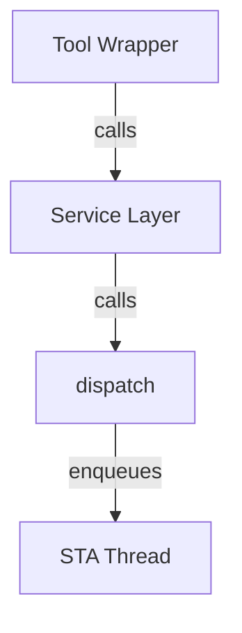

# Contributing to ControlDesk MCP Server

Thank you for contributing to ControlDesk MCP Server! This is an open-source project licensed under the **Apache License 2.0**. All contributions must align with this license and the project's architecture.

---

## Table of Contents

1. [Code of Conduct](#code-of-conduct)
2. [Getting Started](#getting-started)
3. [Development Workflow](#development-workflow)
4. [Code Standards](#code-standards)
5. [Architecture Rules](#architecture-rules)
6. [Testing](#testing)
7. [Commits & Pull Requests](#commits--pull-requests)
8. [Documentation](#documentation)
9. [Reporting Issues](#reporting-issues)
10. [License](#license)

---

## Code of Conduct

All project participants must follow the [Code of Conduct](CODE_OF_CONDUCT.md).
Report violations privately to the project maintainers.

---

## Getting Started

### Prerequisites

- **Python 3.11+** (check with `python --version`)
- **uv** (check with `uv --version`)
- **Git** for version control
- **PowerShell Core** (for development scripts on Windows; optional for Linux/macOS)

### Local Setup — Quick Path (recommended)

A single bootstrap script handles everything: uv installation check, dependency
sync, and smoke tests.

```powershell
# 1. Clone the repository
git clone https://github.com/dSPACEGroup/ControlDeskMCP.git
cd ControlDeskMCP

# 2. Run the setup script
.\scripts\setup.ps1
```

> **Corporate / restricted network?** Pass your package index URL:
>
> ```powershell
> .\scripts\setup.ps1 -PipIndexUrl "https://artifactory.example.com/api/pypi/pypi-remote/simple"
> ```
>
> The setup script maps this value to `UV_INDEX_URL` for the current run.

### Local Setup — Manual Path

If you prefer full control:

```powershell
# Create/update the uv-managed project environment with dev dependencies
uv sync --extra dev

# Verify installation
uv run python -m controldesk_mcp --help
uv run pytest --version
```

`uv sync` is intended for local development and may update `uv.lock` when
project dependencies change. Commit that update with the same change. CI and
release workflows use locked dependency installation and reject stale locks.

### Verify Your Setup

```powershell
# Run smoke tests (no ControlDesk installation required)
uv run pytest -q -m "not integration"

# Run full quality gate
./scripts/quality-gate.ps1
```

---

## Development Workflow

### 1. Create a Feature Branch

```bash
git checkout -b feature/my-feature
# or
git checkout -b fix/issue-123
# or
git checkout -b docs/update-readme
```

Use prefixes: `feature/`, `fix/`, `docs/`, `chore/`, `refactor/`, `test/`.

### 2. Make Changes

- Follow code standards (see [Code Standards](#code-standards))
- Write tests alongside code
- Document new tools and architecture decisions
- Keep commits atomic and logically grouped

### 3. Run Quality Gate

**Before every push**, run:

```powershell
./scripts/quality-gate.ps1
```

This runs:

- **Ruff** — linting (E/F/W/I/N/T20)
- **Black** — format checking (zero-diff compliance)
- **MCP decorator validator** — all `@mcp.tool()` have `name=`, `description=`, `annotations=`
- **Layer boundary check** — no forbidden imports between architecture layers
- **pytest** — unit tests (integration tests skipped)

**Fix issues immediately** — the PR gate will block merge if quality gate fails.

### 4. Push & Open PR

```bash
git push origin feature/my-feature
```

Then open a PR on GitHub targeting `main`. Link related issues using `Closes #123` or `Relates to #123`.

---

## Code Standards

### Python Style

- **Formatter**: Black (zero-config, non-negotiable)
    ```bash
    black controldesk_mcp tests
    ```
- **Linter**: Ruff with rules `E/F/W/I/N/T20`
    ```bash
    ruff check controldesk_mcp tests
    ```
- **Type hints**: Not enforced but encouraged (use `Pydantic` models for inputs)

### MCP Tool Decorators (STRICT)

Every `@mcp.tool()` **must** declare:

```python
@mcp.tool(
    name="my_tool_name",
    description="One-line description of what this tool does.",
    annotations={
        "domain": "platform",           # tool domain (e.g., "platform", "measurement", "variable")
        "group": "configuration",       # logical group (e.g., "configuration", "monitoring")
        "author": "your-name",
        "version": "0.1.0",
        "idempotentHint": True,         # true if tool is idempotent (safe to retry)
    }
)
async def my_tool(params: MyInputModel) -> str:
    """Full docstring with examples."""
    ...
```

Run `python scripts/validate_mcp_tools.py` to verify.

### Naming Conventions

| Element           | Convention                    | Example                        |
| ----------------- | ----------------------------- | ------------------------------ |
| Tool function     | snake_case, verb-first        | `add_measurement_bookmark`     |
| Input model       | PascalCase + `Input` suffix   | `AddMeasurementBookmarkInput`  |
| Output model      | PascalCase + `Output` suffix  | `AddMeasurementBookmarkOutput` |
| Service class     | PascalCase + `Service` suffix | `MeasurementService`           |
| COM domain module | snake_case                    | `measurement_com.py`           |

---

## Architecture Rules

### Four-Layer Architecture (NON-NEGOTIABLE)

| Layer              | Module                               | Rule                                            |
| ------------------ | ------------------------------------ | ----------------------------------------------- |
| **1 — Protocol**   | `controldesk_mcp/server/`, `controldesk_mcp/main.py` | MCP handshake, validation, logging              |
| **2 — Tools**      | `controldesk_mcp/tools/<domain>/`            | Domain logic, formatting, preconditions         |
| **3 — Dispatch**   | `controldesk_mcp.com_bridge.dispatch()`      | Single async entry point; timeout guard         |
| **4 — COM Bridge** | `controldesk_mcp/com_bridge/`                | STA thread, COM lifecycle, error classification |

**FORBIDDEN**:

- Tools importing `controldesk_mcp.com_bridge.connection`, `controldesk_mcp.com_bridge.domains`, `controldesk_mcp.com_bridge.error_mapper`, or `controldesk_mcp.com_bridge.sta_thread` directly.
- Service code using `@mcp.tool()` decorator.
- COM code importing from `controldesk_mcp.tools` or `controldesk_mcp.server`.

**Permitted crossing point**: Only `controldesk_mcp.com_bridge.dispatch()` may be imported outside `com_bridge/`.

The quality gate **automatically checks** for violations:

```powershell
./scripts/quality-gate.ps1  # Fails if any layer violation detected
```

### When Adding a New Tool

1. Create input/output **Pydantic models** in `controldesk_mcp/models/<domain>.py`
2. Add **service function** in `controldesk_mcp/services/<domain>_service.py` (calls `com_bridge.dispatch()` only)
3. Add **@mcp.tool** wrapper in `controldesk_mcp/tools/<domain>/<tool_name>.py` (calls service function)
4. Add **unit tests** in `tests/unit/test_tools/test_<domain>_tools.py` (mock the service)
5. Verify with `./scripts/quality-gate.ps1`

See [AGENTS.md](AGENTS.md) for detailed governance rules.

---

## Testing

### Unit Tests (Required for All Changes)

```bash
# Run unit tests only (fast, no ControlDesk required)
pytest tests/unit/ -v

# Run with coverage report
pytest tests/unit/ --cov=controldesk_mcp --cov-report=html

# Run a specific test file or function
pytest tests/unit/test_tools/test_measurement_tools.py::test_add_bookmark
```

### Integration Tests (Optional; requires live ControlDesk)

```bash
# Run integration tests (marked with @pytest.mark.integration)
pytest -m integration

# Skip integration tests (CI default)
pytest -m "not integration"
```

### Writing Tests

```python
import pytest
from controldesk_mcp.services.measurement_service import add_bookmark

@pytest.fixture
def mock_com_bridge(mocker):
    return mocker.patch("controldesk_mcp.com_bridge.connection.ComBridge")

def test_add_bookmark_success(mock_com_bridge):
    # Arrange: set up mocks
    mock_com_bridge.dispatch.return_value = {"status": "ok"}

    # Act
    result = add_bookmark({"label": "Test"})

    # Assert
    assert "ok" in result
    mock_com_bridge.dispatch.assert_called_once()
```

---

## Commits & Pull Requests

### Commit Messages (Conventional Commits)

Follow [Conventional Commits](https://www.conventionalcommits.org/):

```
<type>(<scope>): <subject>

<body>

<footer>
```

#### Types

| Type       | Scope  | Example                                         |
| ---------- | ------ | ----------------------------------------------- |
| `feat`     | domain | `feat(measurement): add bookmark support`       |
| `fix`      | domain | `fix(variable): handle null values correctly`   |
| `docs`     | —      | `docs: update README installation steps`        |
| `style`    | —      | `style: format code with black`                 |
| `refactor` | scope  | `refactor(com_bridge): simplify error handling` |
| `test`     | scope  | `test(measurement): add bookmark tests`         |
| `chore`    | —      | `chore: upgrade pytest to 8.0`                  |
| `ci`       | —      | `ci: add GitHub Actions workflow`               |

#### Examples

```
feat(platform): add connect/disconnect operations

- Implement platform_connect() with timeout guard
- Implement platform_disconnect() with cleanup
- Add both to @mcp.tool registry

Closes #42
```

```
fix(variable): prevent null pointer in read_scalar

The service was not checking for null dereference before
accessing platform.variables[path]. Now guards with isinstance().

Fixes #89
```

### Pull Request Checklist

Before submitting a PR, ensure:

- [ ] Branch is up-to-date with `main`: `git pull origin main`
- [ ] `./scripts/quality-gate.ps1` passes (lint, format, tests, layer checks)
- [ ] New code has unit tests with ≥80% coverage for that module
- [ ] Commit messages follow Conventional Commits
- [ ] No merge conflicts
- [ ] PR title matches pattern: `<type>(<scope>): <subject>`
- [ ] PR description references related issue(s): `Closes #123`
- [ ] Documentation updated (if needed)

### Review Process

- At least one approval required before merge
- CI/CD checks (GitHub Actions / Azure Pipelines) must pass
- No changes allowed after approval — push new commits instead
- Rebase before merge (no merge commits)

---

## Documentation

### Writing Docs

- **Location**: `docs/` directory
- **Format**: Markdown (`.md`)
- **Style**: Clear, concise, with examples

### Architecture Documentation

When adding new features or domains:

1. **Update [AGENTS.md](AGENTS.md)** with non-obvious knowledge
2. **Create `docs/tools/<domain>-mcp-tools.md`** describing all tools in that domain
3. **Update relevant `.md` files** in `docs/`

### Diagram Rule (STRICT — non-negotiable)

All architecture and flow diagrams **must** use **Mermaid syntax**:



**Rules**:

- Use fenced code blocks: ` ```mermaid ` … ` ``` `
- Choose type: `flowchart`/`graph` (architecture), `sequenceDiagram` (flows), `classDiagram` (types)
- **No PNG/JPG/SVG exports** for diagrams
- **No ASCII art boxes** for new diagrams

Mermaid renders natively in GitHub, VS Code, and MCP Inspector docs.

---

## Reporting Issues

### Security Vulnerabilities

Do not report suspected security vulnerabilities in a public issue. Follow the
private reporting process in the [Security Policy](SECURITY.md).

### Bug Reports and Feature Requests

Use the provided GitHub issue templates. They guide you through the required
information for bug reports and feature requests.

### Discussions

For questions or design discussions, use **GitHub Discussions** instead of issues.

---

## License

By contributing to this project, you agree that:

1. **Your contributions will be licensed under the Apache License 2.0**
2. You have the right to contribute the code (it's your own work or you have permission)
3. You understand the code will be publicly available

The Apache License 2.0 is permissive and includes an explicit patent grant.

See [LICENSE.txt](LICENSE.txt) for full text.

---

## Community & Support

- **Questions?** Open a GitHub Discussion
- **Found a bug?** Open a GitHub Issue
- **Want to discuss design?** Open a GitHub Discussion or PR comment
- **Need help?** Check [README.md](README.md) and [docs/](docs/) first

Thank you for contributing! 🚀
