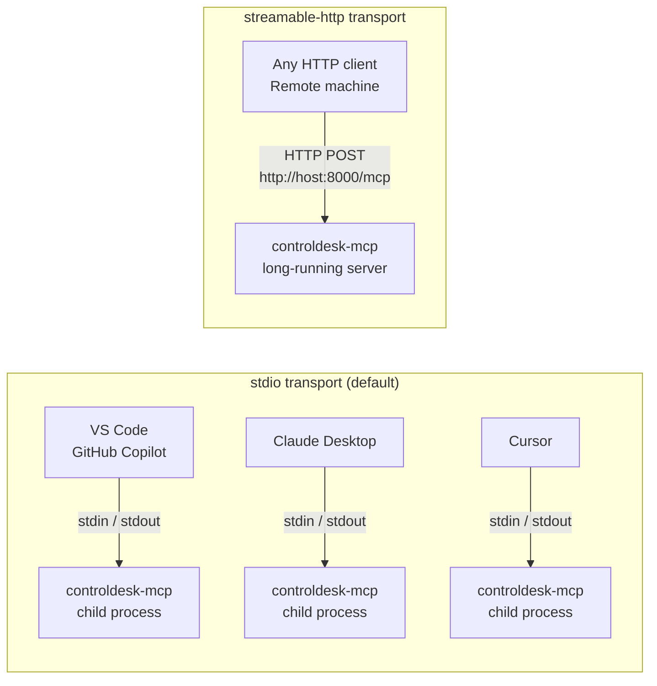
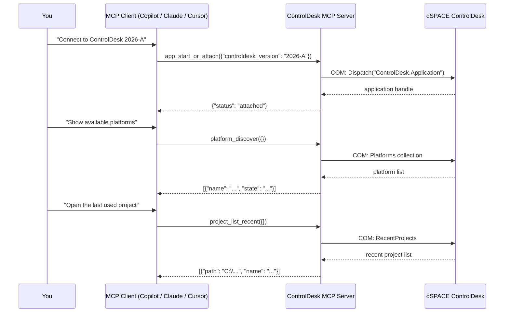

# ControlDesk MCP Server — Client Setup Guide (End-to-End)

This guide walks through every step needed to connect the ControlDesk MCP server
to different MCP clients after it has been installed. If the server is not yet
installed, first follow the installation steps in [README.md](../README.md).

---

## Table of Contents

1. [How MCP Clients Connect to the Server](#how-mcp-clients-connect-to-the-server)
2. [Prerequisites](#prerequisites)
3. [Client A — VS Code + GitHub Copilot](#client-a--vs-code--github-copilot)
4. [Client B — Claude Desktop](#client-b--claude-desktop)
5. [Client C — Cursor](#client-c--cursor)
6. [Client D — MCP Inspector (Developer Tool)](#client-d--mcp-inspector-developer-tool)
7. [Client E — HTTP Transport (Remote / Headless)](#client-e--http-transport-remote--headless)
8. [Verify the Connection (all clients)](#verify-the-connection-all-clients)
9. [First Tools to Try](#first-tools-to-try)
10. [Troubleshooting](#troubleshooting)
11. [Cleanup & Uninstall](#cleanup--uninstall)

---

## How MCP Clients Connect to the Server

The ControlDesk MCP server supports two transport modes:



| Transport           | How it works                                                                   | Best for                                            |
| ------------------- | ------------------------------------------------------------------------------ | --------------------------------------------------- |
| **stdio** (default) | Client spawns the server as a child process; communication is via stdin/stdout | VS Code, Claude Desktop, Cursor — local desktop use |
| **streamable-http** | Server runs as a standalone HTTP daemon; clients connect over the network      | Remote access, CI pipelines, multi-client scenarios |

> **Windows only:** The server's COM bridge requires Windows + dSPACE ControlDesk.
> All clients must run on the same Windows machine as ControlDesk, or access a
> running HTTP-transport instance that does.

---

## Prerequisites

Before configuring any client, confirm:

```powershell
# 1. Server launcher is available from the repo root
.\ControlDeskMCP.cmd --help

# 2. dSPACE ControlDesk is installed (check registry key exists)
Get-ItemProperty "HKLM:\SOFTWARE\dSPACE\ControlDesk" -ErrorAction SilentlyContinue

# 3. Released executable starts and reports its version
C:\path\to\ControlDeskMCP\ControlDeskMCP.exe --version
```

The released-server path is normally:
`C:\path\to\ControlDeskMCP\ControlDeskMCP.exe`. For a source checkout, use
`C:\path\to\ControlDeskMCP\ControlDeskMCP.cmd` and ensure Python 3.11+ and
`uv` are installed.

---

## Client A — VS Code + GitHub Copilot

### What you need

- VS Code ≥ 1.90
- GitHub Copilot extension installed and signed in
- `controldesk-mcp` on PATH (or the full exe path)

### Step 1 — Create or open a workspace

Open VS Code in any folder. This can be an empty folder — the ControlDesk server
does not require a specific codebase to be present.

```powershell
# Example: open an empty workspace
mkdir C:\work\my-controldesk-project
code C:\work\my-controldesk-project
```

### Step 2 — Create `.vscode/mcp.json`

Inside the workspace folder, create `.vscode/mcp.json`:

```json
{
    "servers": {
        "controlDesk": {
            "command": "${workspaceFolder}/ControlDeskMCP.cmd",
            "args": [],
            "type": "stdio",
            "cwd": "${workspaceFolder}",
            "env": {
                "LOG_LEVEL": "INFO"
            }
        }
    }
}
```

> If you launch from a repository checkout, use the launcher script path:
>
> ```json
> "command": "C:\\path\\to\\ControlDeskMCP\\ControlDeskMCP.cmd"
> ```

### Step 3 — Set ControlDesk version (optional but recommended)

Add `CONTROLDESK_VERSION` to `env` to avoid auto-detection on every start:

```json
{
    "servers": {
        "controlDesk": {
            "command": "${workspaceFolder}/ControlDeskMCP.cmd",
            "args": [],
            "type": "stdio",
            "cwd": "${workspaceFolder}",
            "env": {
                "LOG_LEVEL": "INFO",
                "CONTROLDESK_VERSION": "2026-A"
            }
        }
    }
}
```

Replace `2026-A` with your installed version (format `YYYY-L`).

### Step 4 — Start the server

**Option A (automatic):** Open the GitHub Copilot chat panel (`Ctrl+Alt+I`). VS Code
starts the MCP server automatically when a tool-enabled chat session begins.

**Option B (manual):**

1. Open the Command Palette: `Ctrl+Shift+P`
2. Type **MCP: List Servers** → press Enter
3. Find **ControlDesk MCP** → click **Start**

### Step 5 — Confirm the server is running

1. Open the Output panel: `View → Output` (or `Ctrl+Shift+U`)
2. Select **MCP (ControlDesk MCP)** from the dropdown
3. Look for: `INFO     MCP server starting` and `Listening for connections`

### Step 6 — Use tools in GitHub Copilot Chat

1. Open GitHub Copilot Chat: `Ctrl+Alt+I`
2. Switch to **Agent mode** (the dropdown next to the chat input)
3. Ensure the ControlDesk MCP server is enabled (tool icon in the chat toolbar)
4. Type a prompt:

```
Connect to ControlDesk and list the available platforms.
```

Copilot will call `app_start_or_attach` then `platform_discover` automatically.

### Restarting after a server code update

```
Ctrl+Shift+P → MCP: Restart Server → ControlDesk MCP
```

---

## Client B — Claude Desktop

### What you need

- Claude Desktop app installed (https://claude.ai/download)
- `controldesk-mcp` installed and accessible on the machine

### Step 1 — Locate the configuration file

Claude Desktop reads its MCP server configuration from:

```
%APPDATA%\Claude\claude_desktop_config.json
```

Open it in any text editor. If it does not exist, create it.

```powershell
# Open in Notepad
notepad "$env:APPDATA\Claude\claude_desktop_config.json"
```

### Step 2 — Add the server entry

```json
{
    "mcpServers": {
        "controldesk": {
            "command": "controldesk-mcp",
            "args": [],
            "env": {
                "LOG_LEVEL": "INFO",
                "CONTROLDESK_VERSION": "2026-A"
            }
        }
    }
}
```

If you have other MCP servers already configured, add the `"controldesk"` block
inside the existing `"mcpServers"` object without replacing the others.

> **Launcher path example** (recommended from a repository checkout):
>
> ```json
> "command": "C:\\path\\to\\ControlDeskMCP\\ControlDeskMCP.cmd"
> ```

### Step 3 — Restart Claude Desktop

Claude Desktop reads the config only on startup. Close and reopen the application.

### Step 4 — Confirm the server appears

In the Claude Desktop app:

1. Start a new conversation
2. Click the **Tools** icon (hammer icon) in the chat input area
3. The **controldesk** server and its tools should appear in the list

### Step 5 — Test with a prompt

```
Use the controldesk health tool to check the server status.
```

Claude will call the `health` MCP tool and display the result.

---

## Client C — Cursor

### What you need

- Cursor editor installed (https://www.cursor.com)
- `controldesk-mcp` installed and accessible

### Step 1 — Choose global or project-level config

Cursor supports two config locations:

| Scope                       | File                                         | When to Use                                |
| --------------------------- | -------------------------------------------- | ------------------------------------------ |
| **Global** (all projects)   | `%USERPROFILE%\.cursor\mcp.json`             | Server available in every Cursor workspace |
| **Project** (one workspace) | `.cursor\mcp.json` inside the project folder | Per-project override                       |

### Step 2 — Edit the config file

```powershell
# Global config
notepad "$env:USERPROFILE\.cursor\mcp.json"

# Project-level config (create .cursor\ folder first if needed)
mkdir .cursor -ErrorAction SilentlyContinue
notepad ".cursor\mcp.json"
```

Add the following content:

```json
{
    "mcpServers": {
        "controldesk": {
            "command": "controldesk-mcp",
            "args": [],
            "env": {
                "LOG_LEVEL": "INFO",
                "CONTROLDESK_VERSION": "2026-A"
            }
        }
    }
}
```

### Step 3 — Reload Cursor

Open the Command Palette (`Ctrl+Shift+P`) and run:

```
Developer: Reload Window
```

### Step 4 — Confirm the server is active

1. Open Cursor Settings (`Ctrl+,`)
2. Navigate to **Features → MCP** (or search for "MCP")
3. The `controldesk` server should show a green status indicator

### Step 5 — Use tools in Cursor chat

Open the Cursor AI chat panel (`Ctrl+L`) and type:

```
@controldesk Connect to ControlDesk and show the current project.
```

Cursor will invoke the relevant MCP tools automatically.

---

## Client D — MCP Inspector (Developer Tool)

The MCP Inspector is a browser-based UI for **manually testing** MCP tools without
an LLM. It is the primary development and debugging tool for this server.

### What you need

- Node.js ≥ 18 installed (`node --version`)
- `npx` available (bundled with Node.js)

### Option 1 — Launch from the installed entry point (no codebase needed)

```powershell
# Inspector spawns the server as a child process via stdio
npx @modelcontextprotocol/inspector controldesk-mcp

# With the repository launcher script:
npx @modelcontextprotocol/inspector "C:\path\to\ControlDeskMCP\ControlDeskMCP.cmd"

# With environment variables:
npx @modelcontextprotocol/inspector `
    --env LOG_LEVEL=DEBUG `
    --env CONTROLDESK_VERSION=2026-A `
    controldesk-mcp
```

### Option 2 — Launch from the source repo (development)

```powershell
# From the repo root — uses the workspace source tree directly
./scripts/inspect.ps1
```

### Step-by-step walkthrough

1. Run the npx command above — a URL appears:
    ```
    Open Inspector: http://localhost:5173
    ```
2. Open `http://localhost:5173` in a browser.
3. The Inspector connects automatically (the server is already running as a child process).
4. Navigate the tabs:

| Tab           | What it shows                                                   |
| ------------- | --------------------------------------------------------------- |
| **Tools**     | All registered `@mcp.tool` functions with their schemas         |
| **Resources** | All `@mcp.resource` endpoints (server info, tool catalog, etc.) |
| **Prompts**   | All `@mcp.prompt` workflow templates                            |

5. To test a tool:
    - Click a tool name (e.g., `health`)
    - Fill in parameters (if any)
    - Click **Run Tool**
    - The response appears in the right panel

6. Press `Ctrl+C` in the terminal to stop both the Inspector and the server.

> **Note:** The Inspector spawns the server fresh each time. You cannot attach the
> Inspector to a server that is already running in another process.

---

## Client E — HTTP Transport (Remote / Headless)

Use `streamable-http` transport when you need to:

- Access the server from a different machine on the same network
- Run the server as a long-lived background service
- Connect multiple clients to one server instance simultaneously

### Step 1 — Start the server in HTTP mode

On the **Windows machine with ControlDesk**:

```powershell
# Using environment variables
$env:MCP_TRANSPORT = "streamable-http"
$env:MCP_HOST      = "0.0.0.0"   # listen on all interfaces (use 127.0.0.1 for local only)
$env:MCP_PORT      = "8000"
$env:LOG_LEVEL     = "INFO"
$env:CONTROLDESK_VERSION = "2026-A"

controldesk-mcp
```

The server will output:

```
INFO     Serving on http://0.0.0.0:8000/mcp
```

### Step 2 — Configure the client for HTTP transport

**VS Code `.vscode/mcp.json`:**

```json
{
    "servers": {
        "controlDeskHttp": {
            "url": "http://192.168.1.100:8000/mcp",
            "type": "http"
        }
    }
}
```

Replace `192.168.1.100` with the IP address of the Windows machine running the server.

**Claude Desktop `claude_desktop_config.json`:**

Claude Desktop does not natively support HTTP MCP servers in all versions. Check the
[Claude Desktop release notes](https://claude.ai/download) for the current transport
support status.

**Cursor `.cursor/mcp.json`:**

```json
{
    "mcpServers": {
        "controldesk": {
            "url": "http://192.168.1.100:8000/mcp",
            "type": "http"
        }
    }
}
```

### Step 3 — Firewall rule (if connecting from another machine)

```powershell
# Run as Administrator on the server machine
New-NetFirewallRule `
    -DisplayName "ControlDesk MCP Server" `
    -Direction Inbound `
    -Protocol TCP `
    -LocalPort 8000 `
    -Action Allow
```

> **Security:** The HTTP server has no built-in authentication. Restrict access
> with firewall rules and only expose it on trusted internal networks. Do not
> expose port 8000 to the public internet.

### Step 4 — Run as a Windows Service (optional, for always-on access)

```powershell
# Install NSSM (Non-Sucking Service Manager) to wrap any exe as a Windows service
winget install nssm

# Create the service
nssm install ControlDeskMCP "C:\path\to\ControlDeskMCP\ControlDeskMCP.cmd"
nssm set ControlDeskMCP AppEnvironmentExtra `
    "MCP_TRANSPORT=streamable-http" `
    "MCP_HOST=0.0.0.0" `
    "MCP_PORT=8000" `
    "CONTROLDESK_VERSION=2026-A" `
    "LOG_LEVEL=INFO"

# Start the service
nssm start ControlDeskMCP

# Check status
nssm status ControlDeskMCP
```

---

## Verify the Connection (all clients)

After configuring any client, use the `health` tool to confirm the server is
reachable and responding. The health tool never makes a COM call — it is safe
to call even before ControlDesk is launched.

### What to call

| Tool                  | Input                               | Expected output                                                |
| --------------------- | ----------------------------------- | -------------------------------------------------------------- |
| `health`              | _(none)_                            | `{"status": "ok", "version": "0.1.0", ...}`                    |
| `app_start_or_attach` | `{"controldesk_version": "2026-A"}` | `{"status": "attached", ...}` or `{"status": "launched", ...}` |
| `platform_discover`   | `{}`                                | JSON list of configured platforms                              |

### In VS Code Copilot Chat

```
Call the health tool on the ControlDesk MCP server.
```

### In Claude Desktop

```
Use the controldesk health tool and show me the result.
```

### In MCP Inspector

- Tools tab → `health` → Run Tool → check response

---

## First Tools to Try

Once connected, follow this sequence for a typical ControlDesk automation session:



**Suggested first prompts by client:**

```
# Getting started
Connect to ControlDesk and show me the available platforms.

# Project management
List my recent ControlDesk projects and open the most recent one.

# Measurement
Start a measurement on raster 'MainRaster' and record signals for 10 seconds.

# Variables
Read the current value of variable '/Model/Signal/VehicleSpeed'.

# Calibration
List the calibration objects available on the main platform.
```

---

## Troubleshooting

### Server does not appear in the client's tool list

1. Check the config file path and JSON syntax — even a trailing comma breaks JSON.
2. Restart the client after editing the config.
3. Verify the command is reachable:
    ```powershell
    .\ControlDeskMCP.cmd --help
    ```

# or full path:

"C:\path\to\ControlDeskMCP\ControlDeskMCP.cmd" --help

````

### `app_start_or_attach` returns an error about ControlDesk not found

- Confirm ControlDesk is installed: check `Start Menu` or the registry key
`HKLM:\SOFTWARE\dSPACE\ControlDesk`.
- Set `CONTROLDESK_VERSION` explicitly (e.g., `2026-A`) instead of leaving it empty.
- Increase the launch timeout:
```json
"env": { "COM_LAUNCH_TIMEOUT_MS": "60000" }
````

### Tools time out or return `COM_TIMEOUT`

- ControlDesk may be busy. Increase `COM_TIMEOUT_MS`:
    ```json
    "env": { "COM_TIMEOUT_MS": "30000" }
    ```

### VS Code shows the server as "stopped" immediately

Check the VS Code Output panel (`View → Output → MCP (ControlDesk MCP)`) for the
Python traceback. Common causes:

- `ModuleNotFoundError: No module named 'controldesk_mcp'` or
  `ImportError: No module named 'win32com'` — the source launcher was selected
  without its local environment. Use `ControlDeskMCP.exe` for a release install,
  or run `uv sync` in the repository before using `ControlDeskMCP.cmd`.

### Claude Desktop: tools visible but calls fail silently

Enable debug logging in the config:

```json
"env": { "LOG_LEVEL": "DEBUG" }
```

Then check logs at: `%APPDATA%\Claude\logs\`

### Cursor: MCP server shows red status

- Reload the window: `Ctrl+Shift+P → Developer: Reload Window`
- Check Cursor's MCP settings page for error details.

### HTTP transport: connection refused from remote machine

- Confirm the server is listening: `netstat -an | findstr 8000`
- Check the firewall rule allows inbound TCP 8000.
- Ensure `MCP_HOST=0.0.0.0` (not `127.0.0.1`) when connecting from another machine.

---

## Config File Reference

| Client           | Config File Location                          | Format                  |
| ---------------- | --------------------------------------------- | ----------------------- |
| VS Code          | `.vscode\mcp.json` (per workspace)            | `{"servers": {...}}`    |
| Claude Desktop   | `%APPDATA%\Claude\claude_desktop_config.json` | `{"mcpServers": {...}}` |
| Cursor (global)  | `%USERPROFILE%\.cursor\mcp.json`              | `{"mcpServers": {...}}` |
| Cursor (project) | `.cursor\mcp.json` (in project root)          | `{"mcpServers": {...}}` |

## Environment Variables Reference

Set these in the `env` block of any client config:

| Variable                 | Default         | Description                                 |
| ------------------------ | --------------- | ------------------------------------------- |
| `CONTROLDESK_VERSION`    | _(auto-detect)_ | ControlDesk version, e.g. `2026-A`          |
| `LOG_LEVEL`              | `INFO`          | `DEBUG` / `INFO` / `WARNING` / `ERROR`      |
| `COM_TIMEOUT_MS`         | `8000`          | Milliseconds per COM call                   |
| `COM_LAUNCH_TIMEOUT_MS`  | `30000`         | Milliseconds to wait for ControlDesk window |
| `COM_RECONNECT_ATTEMPTS` | `3`             | Retries after COM disconnect                |
| `MCP_TRANSPORT`          | `stdio`         | `stdio` or `streamable-http`                |
| `MCP_HOST`               | `127.0.0.1`     | Bind address (HTTP transport only)          |
| `MCP_PORT`               | `8000`          | Port number (HTTP transport only)           |

---

## Cleanup & Uninstall

### Remove the server

To remove a released ControlDesk MCP server, delete `ControlDeskMCP.exe` and
`ControlDeskMCP.exe.sha256`, then remove the corresponding MCP client entry.

```powershell
Remove-Item C:\path\to\ControlDeskMCP\ControlDeskMCP.exe
Remove-Item C:\path\to\ControlDeskMCP\ControlDeskMCP.exe.sha256
```

For a source checkout, remove its local environment:

```powershell
# Remove the local uv-managed environment
Remove-Item -Recurse -Force .venv

# Verify the environment is gone
Test-Path .venv
# Should return: $false
```

### Remove client configurations

If you want to clean up without uninstalling the server, remove the config files:

```powershell
# VS Code (per-workspace)
Remove-Item .vscode\mcp.json

# Claude Desktop (global)
Remove-Item "$env:APPDATA\Claude\claude_desktop_config.json"

# Cursor (global)
Remove-Item "$env:USERPROFILE\.cursor\mcp.json"
```

### Verify complete removal

```powershell
# Check the uv-managed environment is gone
Test-Path .venv
# Should return: $false
```
