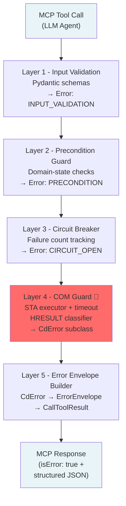
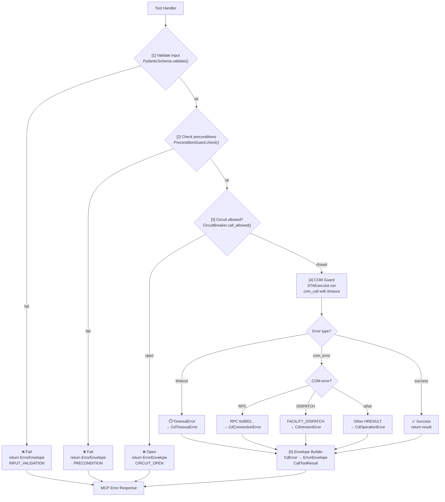

# ControlDesk MCP — Error Handling Architecture

**Scope:** Python MCP server wrapping ControlDesk COM automation (`ControlDeskNG.Application.2026-A`)  
**Context:** Every failure in ControlDesk propagates back as a COM error. The architecture below converts that into structured, actionable errors for LLM agents.

---

## Architecture Overview

### Layer Stack



### Component Interaction Flow



---

## Layer Definitions

### Layer 1 — Input Validation

**What:** Pydantic model bound to every `@mcp.tool()` input. Arguments are validated and coerced before any code runs.

**Why:**
- Eliminates `DISP_E_TYPEMISMATCH` / `DISP_E_BADPARAMCOUNT` COM errors before they happen.
- Pydantic produces structured error messages the LLM can read and self-correct from.
- JSON Schema is auto-generated — the LLM agent knows exactly what each tool expects.
- Rust-backed core; zero latency overhead.

```python
class MeasurementStartInput(BaseModel):
    timeout_ms: int = Field(default=10000, ge=1000, le=60000)
    trigger_mode: Literal["immediate", "external"] = "immediate"
```

---

### Layer 2 — Precondition Guard

**What:** Explicit domain-state checks before any COM call. Reads cached server state (experiment loaded, platform connected, measurement running).

**Why:**
- Precondition failures are **not COM errors** — wrapping them in HRESULT classification loses context.
- Avoids a round-trip COM call that would fail anyway.
- Error codes here are deterministic and not retryable until the user fixes domain state.

**Checks performed:**

| Check | Error Code |
|-------|-----------|
| No active experiment | `CD_NO_EXPERIMENT` |
| Platform not connected | `CD_PLATFORM_DISCONNECTED` |
| Measurement already running | `CD_MEASUREMENT_ACTIVE` |
| Calibration not started | `CD_CALIBRATION_NOT_STARTED` |
| 32-bit Python process | `CD_WRONG_BITNESS` |

---

### Layer 3 — Circuit Breaker

**What:** Per-interface failure counter with three states. Prevents cascading COM calls to a broken ControlDesk instance.

**Why:**
- COM calls to a frozen ControlDesk still block the STA thread for the full timeout before failing. A circuit breaker makes subsequent calls fail instantly.
- Per-interface scope — one broken interface does not affect others.
- Enables graceful degradation during ControlDesk instability.

**States:**

```
CLOSED    --[N failures in window]--> OPEN
OPEN      --[cool-down expires]-----> HALF-OPEN
HALF-OPEN --[probe succeeds]---------> CLOSED
HALF-OPEN --[probe fails]-----------> OPEN
```

**Configuration (per interface):**

| Parameter | Default | Description |
|-----------|---------|-------------|
| `failure_threshold` | 3 | Consecutive failures to open the circuit |
| `window_seconds` | 60 | Rolling window for counting failures |
| `cooldown_seconds` | 30 | Time in OPEN state before probing |

**Interfaces covered:** `controldesk_app_start_or_attach`, `controldesk_platform_connect`, `experiment_load_and_activate`.
All other interfaces rely on COM Guard retry only.

**Error code produced:** `CIRCUIT_OPEN`  
**Recovery hint:** `"Wait 30 s and retry, or call controldesk_app_start_or_attach to reset the connection."`

---

### Layer 4 — COM Guard

**What:** Async context manager wrapping every COM call. Owns four responsibilities: STA thread dispatch, timeout enforcement, HRESULT classification, and `ILoLog` correlation write.

**Why:**
- ControlDesk COM objects are **STA-bound** — they must be called from the thread that created them. `asyncio` runs on a different thread; without an STA executor every COM call raises `RPC_E_WRONGTHREAD` (`0x8001010E`).
- ControlDesk can open a modal dialog during any COM call and block the thread indefinitely. Without a timeout, the MCP tool call hangs forever with no error.
- HRESULT values alone are ambiguous — `FACILITY_ITF` codes are per-interface. The guard adds interface name, method name, and `IErrorInfo` description.
- Writing to `Application.Log` via `ILoLog` creates a cross-system audit trail linked by `correlation_id`.

#### 4.1 STA Threading

ControlDesk's COM automation (`IDispatch`) runs on an **STA (Single-Threaded Apartment)** — meaning the COM object must be called from the exact OS thread that created it. The `asyncio` event loop runs on a different thread.

**Solution:** A dedicated single-thread `ThreadPoolExecutor` initialised with `CoInitialize()`.

```python
import concurrent.futures, pythoncom

sta_executor = concurrent.futures.ThreadPoolExecutor(
    max_workers=1,
    initializer=pythoncom.CoInitialize   # COM STA init on this thread only
)

# All COM calls dispatched via:
result = await asyncio.get_event_loop().run_in_executor(sta_executor, com_call)
```

**If skipped:** `RPC_E_WRONGTHREAD` (`0x8001010E`) — appears as a misleading "wrong thread" error with no obvious cause.

#### 4.2 Timeout and UI Blocking

**Root cause (documented in ControlDeskMCD3Automation.pdf §8.5):**
> *"ControlDesk's error messages are not transported to the automation system. The automation sequence is paused until the error message is confirmed by the user."*

Any modal dialog (error box, warning, confirmation) in ControlDesk **blocks the COM call on the STA thread**. From Python the call simply hangs — `com_error` is never raised.

**Solution:** Wrap `run_in_executor` with `asyncio.timeout`:

```python
@asynccontextmanager
async def com_guard(ctx, *, interface: str, method: str, timeout_ms: int = 8000):
    corr_id = str(uuid.uuid4())
    try:
        async with asyncio.timeout(timeout_ms / 1000):
            yield   # COM call happens here on STA thread
    except asyncio.TimeoutError:
        raise CdTimeoutError(
            f"{interface}.{method} exceeded {timeout_ms} ms — "
            "ControlDesk may be waiting for user input.",
            recovery_hint=(
                "Set Platform.DisplayStatusInformation = False before long operations, "
                "or dismiss any open ControlDesk dialog."
            ),
            correlation_id=corr_id,
        )
    except pywintypes.com_error as e:
        raise _classify(e, interface, method, corr_id) from e
```

**Disable UI dialogs proactively** (call once after attaching):
```python
for platform in app.ActiveExperiment.Platforms:
    platform.DisplayStatusInformation = False
```

**Signals that UI blocking is happening:**
- `RPC_E_CALL_REJECTED` (`0x80010001`) — STA message pump is busy (dialog open).
- `asyncio.TimeoutError` on an otherwise healthy connection.

#### 4.3 HRESULT Classification

**Key rule:** `DISP_E_EXCEPTION` (`0x80020009`) is the HRESULT ControlDesk uses for virtually all internal errors. The actual error text is in `IErrorInfo.Description` — `e.args[2][2]` — not the HRESULT code.

```python
def _classify(e: pywintypes.com_error, iface, method, corr_id) -> CdError:
    hr = e.args[0] & 0xFFFFFFFF           # normalise to unsigned
    facility = (hr >> 16) & 0x1FFF
    desc = (e.args[2][2] if e.args[2] else None) or str(e.args[1])

    if hr in (0x80010001, 0x80010108):    # RPC_E_CALL_REJECTED, RPC_E_DISCONNECTED
        return CdBlockedByUiError(desc, hresult=hr, ...)
    if hr == 0x80004007:                  # CO_E_SERVER_STOPPING
        return CdConnectionError(desc, hresult=hr, ...)
    if facility == 1:                     # FACILITY_RPC
        return CdConnectionError(desc, hresult=hr, ...)
    if facility == 2:                     # FACILITY_DISPATCH — version mismatch
        return CdVersionError(desc, hresult=hr, ...)
    if hr == 0x80020009:                  # DISP_E_EXCEPTION — read IErrorInfo
        return CdOperationError(desc, hresult=hr, ...)
    return CdOperationError(desc, hresult=hr, ...)
```

#### 4.4 Retry Logic

Applied for `retryable=True` errors only. Exponential backoff with jitter.

```
Attempt 1 -> fail (retryable)
Wait: 500 ms +/- 200 ms jitter  ->  Attempt 2
Wait: 1000 ms +/- 200 ms jitter ->  Attempt 3
                                 ->  Raise final CdError
```

| Parameter | Value |
|-----------|-------|
| `max_attempts` | 3 |
| `base_delay_ms` | 500 |
| `jitter_ms` | +/- 200 |

**Retryable errors:** `CdBlockedByUiError`, `CdConnectionError` (transient), `CdTimeoutError`.  
**Non-retryable:** `CdOperationError`, `CdVersionError`, `CdPreconditionError`.

---

### Layer 5 — Error Envelope Builder

**What:** Converts any `CdError` subclass into a Pydantic `ErrorEnvelope`. Produces a markdown card for human clients and a structured JSON payload for LLM agents via `structuredContent`.

**Why:**
- `structuredContent` lets the LLM parse `category`, `retryable`, and `recovery_hint` without screen-scraping markdown.
- `correlation_id` links the MCP error to an `ILoLog` entry in ControlDesk's own log.
- `recovery_hint` makes every error actionable without human intervention.
- Single Pydantic model is serialisable, testable, and version-stable.

```python
class ErrorEnvelope(BaseModel):
    error_code:     str                  # e.g. "COM_DISCONNECTED"
    category:       ErrorCategory        # see error code table
    message:        str                  # one-sentence human description
    detail:         str                  # HRESULT hex + IErrorInfo text
    hresult:        int | None           # raw HRESULT (unsigned), None if not COM
    interface:      str | None           # COM interface name
    method:         str | None           # COM method name
    retryable:      bool                 # True = LLM may retry
    recovery_hint:  str                  # actionable instruction
    correlation_id: str                  # UUID -> ILoLog entry
```

```python
return CallToolResult(
    content=[TextContent(type="text", text=markdown_card)],
    structuredContent=envelope.model_dump(),
    isError=True,
)
```

---

## CdError Exception Hierarchy

```python
CdError                          # base: retryable=False
+-- CdConnectionError            # retryable=True  -- RPC disconnect / server stop
+-- CdBlockedByUiError           # retryable=True  -- RPC_E_CALL_REJECTED / dialog
+-- CdTimeoutError               # retryable=True  -- asyncio.TimeoutError
+-- CdPreconditionError          # retryable=False -- domain state not ready
+-- CdOperationError             # retryable=False -- DISP_E_EXCEPTION / E_FAIL
+-- CdVersionError               # retryable=False -- DISP_E_MEMBERNOTFOUND
+-- CdCircuitOpenError           # retryable=True  -- circuit breaker OPEN
```

---

## Pydantic: Why We Use It

| Reason | Benefit |
|--------|---------|
| **Type coercion** | Converts `"10"` to `10` automatically; no hand-written parsing |
| **JSON Schema generation** | LLM agents see the exact input contract for every tool |
| **Structured error reports** | Validation failure output says exactly which field and why |
| **Rust core** | Sub-millisecond validation; no performance cost on tool calls |

---

## Error Code Reference

| `error_code` | Category | HRESULT(s) | Retryable | Recovery Hint |
|---|---|---|:---:|---|
| `CD_BAD_INPUT` | `INPUT_VALIDATION` | — | No | Fix the tool call arguments |
| `CD_NO_EXPERIMENT` | `PRECONDITION` | — | No | Call `experiment_load_and_activate` |
| `CD_PLATFORM_DISCONNECTED` | `PRECONDITION` | — | No | Call `controldesk_platform_connect` |
| `CD_MEASUREMENT_ACTIVE` | `PRECONDITION` | — | No | Stop measurement first |
| `CD_CALIBRATION_NOT_STARTED` | `PRECONDITION` | — | No | Call `controldesk_calibration_start` |
| `CD_WRONG_BITNESS` | `PRECONDITION` | — | No | Use 64-bit Python |
| `CIRCUIT_OPEN` | `CIRCUIT` | — | Yes | Wait cool-down; call `controldesk_app_start_or_attach` |
| `COM_TIMEOUT` | `TIMEOUT` | — | Yes | Dismiss dialog; set `DisplayStatusInformation=False` |
| `COM_UI_BLOCKING` | `UI_BLOCKING` | `0x80010001` | Yes | Dismiss dialog; set `DisplayStatusInformation=False` |
| `COM_DISCONNECTED` | `CONNECTION` | `0x80010108` | Yes | Call `controldesk_app_start_or_attach` |
| `COM_SERVER_STOPPING` | `CONNECTION` | `0x80004007` | Yes | Wait and call `controldesk_app_start_or_attach` |
| `COM_WRONG_THREAD` | `CONNECTION` | `0x8001010E` | No | STA executor not initialised — server config error |
| `CD_VERSION_MISMATCH` | `VERSION` | `0x80020003`, `0x80020006` | No | Verify ControlDesk version matches ProgID |
| `CD_OPERATION_FAILED` | `OPERATION` | `0x80004005`, `0x80020009` | No | Check ControlDesk Messages pane; use `correlation_id` |
| `CD_INVALID_ARGUMENT` | `OPERATION` | `0x80070057` | No | Fix the parameter value |
| `CD_ACCESS_DENIED` | `SYSTEM` | `0x80070005` | No | Check dSPACE license and user rights |
| `CD_OUT_OF_MEMORY` | `SYSTEM` | `0x8007000E` | Yes | Free resources and retry |
| `CD_NOT_LICENSED` | `SYSTEM` | `0x80040112` | No | Install correct dSPACE license |
| `CD_OBJECT_INVALID` | `OPERATION` | `0x80020009` + `"Object is invalid"` | No | COM object released; re-acquire via `app.ActiveExperiment` |
| `CD_UNKNOWN` | `UNKNOWN` | any | No | Inspect dSPACE Log via `correlation_id` |

### HRESULT Quick Reference

| HRESULT | Hex | Facility | Note |
|---------|-----|----------|------|
| `E_FAIL` | `0x80004005` | NULL | Generic failure — most `CD_OPERATION_FAILED` map here |
| `E_NOINTERFACE` | `0x80004002` | NULL | Interface not supported on this object |
| `E_NOTIMPL` | `0x80000001` | NULL | Method not implemented |
| `CO_E_SERVER_STOPPING` | `0x80004007` | NULL | ControlDesk is shutting down |
| `CLASS_E_NOTLICENSED` | `0x80040112` | ITF | No dSPACE license |
| `RPC_E_CALL_REJECTED` | `0x80010001` | RPC | STA busy — ControlDesk dialog is open |
| `RPC_E_DISCONNECTED` | `0x80010108` | RPC | ControlDesk process closed |
| `RPC_E_WRONGTHREAD` | `0x8001010E` | RPC | COM called from wrong thread — STA executor missing |
| `RPC_E_SERVERFAULT` | `0x80010105` | RPC | Exception propagated from COM server |
| `DISP_E_MEMBERNOTFOUND` | `0x80020003` | DISPATCH | Method not found — version mismatch |
| `DISP_E_TYPEMISMATCH` | `0x80020005` | DISPATCH | Wrong argument type |
| `DISP_E_UNKNOWNNAME` | `0x80020006` | DISPATCH | Property name not recognised |
| `DISP_E_EXCEPTION` | `0x80020009` | DISPATCH | **ControlDesk app-level error — read `IErrorInfo.Description`** |
| `DISP_E_BADINDEX` | `0x8002000B` | DISPATCH | Collection index out of range |
| `DISP_E_BADPARAMCOUNT` | `0x8002000E` | DISPATCH | Wrong number of arguments |

---

## End-to-End Example

**Tool:** `controldesk_measurement_start`
**Scenario:** LLM calls the tool, but ControlDesk has a modal dialog open that blocks the COM thread.

### Request
```json
{ "tool": "controldesk_measurement_start", "arguments": { "timeout_ms": 8000 } }
```

### Flow

```
[1] Input Validation
    OK  timeout_ms=8000 is valid (range: 1000-60000)

[2] Precondition Guard
    OK  Experiment is active
    OK  Platform is connected
    OK  Measurement not already running

[3] Circuit Breaker
    OK  IXaMeasurementConfiguration -> CLOSED (no recent failures)

[4] COM Guard
    -> run_in_executor(sta_thread, app.MeasurementDataManagement.Start)
    -> asyncio.timeout(8.0 s)
    X   8 seconds elapse -- ControlDesk had an error dialog open
    -> asyncio.TimeoutError caught
    -> raise CdTimeoutError(
           message="IXaMeasurementConfiguration.Start exceeded 8000 ms",
           recovery_hint="Dismiss dialog or set DisplayStatusInformation=False",
           correlation_id="f3a1b2c4-..."
       )
    -> writes ILoLog entry with correlation_id="f3a1b2c4-..."

[5] Envelope Builder
    -> ErrorEnvelope(
           error_code="COM_TIMEOUT",
           category="TIMEOUT",
           retryable=True,
           recovery_hint="Dismiss dialog or set DisplayStatusInformation=False",
           correlation_id="f3a1b2c4-..."
       )
```

### Response
```json
{
  "isError": true,
  "content": [{ "type": "text", "text": "## Error: COM_TIMEOUT\n**Retryable:** true\n**Hint:** Dismiss dialog or set DisplayStatusInformation=False\n**Correlation ID:** f3a1b2c4-..." }],
  "structuredContent": {
    "error_code": "COM_TIMEOUT",
    "category": "TIMEOUT",
    "retryable": true,
    "recovery_hint": "Dismiss dialog or set DisplayStatusInformation=False",
    "correlation_id": "f3a1b2c4-..."
  }
}
```

**Agent next action:** Reads `retryable=true` + `recovery_hint`. Calls `set_display_status_information(enabled=False)`, then retries `controldesk_measurement_start`.

---

*See also: [architecture.md](architecture.md) for the five-layer server architecture and COM bridge internals.*
