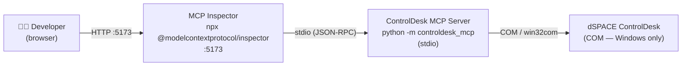
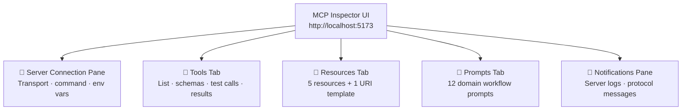
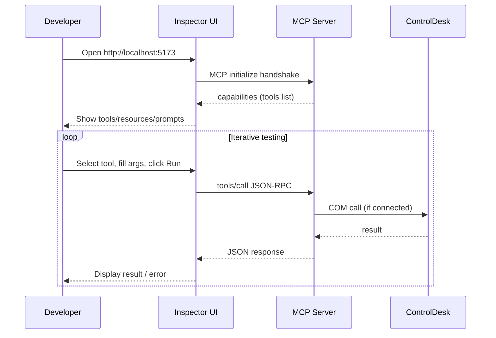
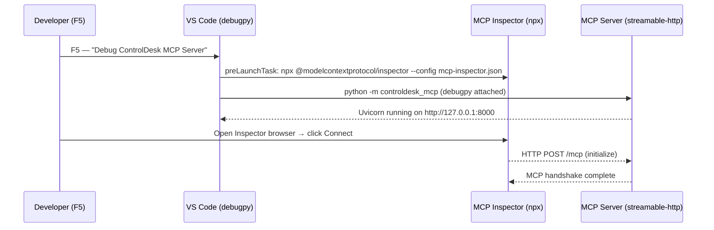

# MCP Inspector — Developer Guide

The [MCP Inspector](https://github.com/modelcontextprotocol/inspector) is an
interactive browser-based developer tool for exploring, testing, and debugging
MCP servers **without** needing a full LLM host (Claude, VS Code Copilot, etc.).

This guide explains how to use it with the ControlDesk MCP server.

---

## What It Is

MCP Inspector is an external `npx` package maintained by the MCP project.
It is **not** part of this repository — it lives on npm as
`@modelcontextprotocol/inspector`. The integration here is a single launcher
script (`scripts/inspect.ps1`) that wires the Inspector to our server.

```
External tool:  npx @modelcontextprotocol/inspector
Our launcher :  scripts/inspect.ps1
```

---

## Architecture



The Inspector spawns the MCP server as a **child process** via stdio transport.
The browser UI proxies all MCP messages through the Inspector process.

> **Note:** COM calls to ControlDesk only work on Windows with ControlDesk
> installed. The Inspector itself and most of its tabs (Tools list, schema
> inspection, etc.) work without a live ControlDesk — only tool _execution_
> requires the COM connection.

---

## Quick Start

### Prerequisites

| Requirement                        | Version       | Check              |
| ---------------------------------- | ------------- | ------------------ |
| Node.js (for `npx`)                | ≥ 18          | `node --version`   |
| Python                             | ≥ 3.11        | `python --version` |
| ControlDesk _(for tool execution)_ | any supported | —                  |

### Launch

```powershell
# From repo root
./scripts/inspect.ps1
```

The script will:

1. Verify `npx` is on PATH (fails with a helpful message if not).
2. Run `uv sync --extra dev` to ensure Python deps are up-to-date.
3. Start `npx -y @modelcontextprotocol/inspector python -m controldesk_mcp`.
4. Open your browser to **http://localhost:5173**.

Press **Ctrl+C** to stop both the Inspector and the server.

---

## Inspector Tabs



---

### Tools Tab

All `@mcp.tool()` functions registered in `controldesk_mcp/tools/**` appear here.
Registered via `controldesk_mcp/server/registry.py`.

For each tool you can:

- Read the **description** and **input schema** (Pydantic model → JSON Schema).
- Fill in arguments and **execute** the tool live.
- Inspect the raw **JSON response** and any error envelope.

---

### Resources Tab

Resources are **read-only data** the Inspector and LLMs can fetch by URI.
All resources are always available — no ControlDesk connection is required.

Registered via `controldesk_mcp/resources/server_resources.py` and `controldesk_mcp/resources/domain_resources.py`.

| URI                                      | Name              | Description                                              |
| ---------------------------------------- | ----------------- | -------------------------------------------------------- |
| `controldesk://server/info`              | ServerInfo        | Server version, transport, COM timeout settings          |
| `controldesk://server/tool-catalog`      | ToolCatalog       | Full list of registered tools, sorted, with descriptions |
| `controldesk://server/connection-status` | ConnectionStatus  | In-memory COM bridge state — no COM call made            |
| `controldesk://server/domains`           | DomainList        | All tool domains + URI template hint                     |
| `controldesk://tools/{domain}`           | DomainToolCatalog | **URI template** — filtered tool list for one domain     |

> **URI Template:** The Inspector shows `controldesk://tools/{domain}` under "Resource Templates".
> Fill in a domain name (e.g., `measurement`) to get a filtered tool catalog.
> Valid domain values: `application`, `bus_logging`, `bus_monitor`, `bus_replay`,
> `calibration`, `measurement`, `platform`, `project`, `recorder`, `tool_window`, `variable`.

**How to use in the Inspector:**

1. Open the **Resources** tab in the browser UI.
2. Click any resource URI to fetch it.
3. For `controldesk://tools/{domain}`, expand "Resource Templates", enter a domain name, and click Fetch.
4. `connection-status` reflects the bridge state live — re-fetch after calling `controldesk_app_start_or_attach`.

**Adding a new resource:**

- **Server-level**: add to `controldesk_mcp/resources/server_resources.py`.
- **Domain tool catalog**: add the prefix to `_DOMAIN_PREFIXES` in `controldesk_mcp/resources/domain_resources.py`.
- **New resource type**: create `controldesk_mcp/resources/<name>_resources.py` and import in `registry.py`.
- Always add unit tests in `tests/unit/test_resources/test_<name>_resources.py`.

---

### Prompts Tab

Prompts are **parameterized message templates** that guide the LLM through
a specific ControlDesk workflow. The Inspector lets you fill in prompt arguments
and preview the generated messages before sending them to an LLM.

Prompts are organised one file per domain under `controldesk_mcp/prompts/`.

| Prompt Name                 | File                     | Parameters                                                   | Purpose                                               |
| --------------------------- | ------------------------ | ------------------------------------------------------------ | ----------------------------------------------------- |
| `start_automation_session`  | `session_prompts.py`     | `project_path`, `platform_name`, `controldesk_version`       | Full session setup: app → project → platform → verify |
| `diagnose_connection`       | `session_prompts.py`     | `error_message`, `tool_name`                                 | Diagnose COM / connection failures step by step       |
| `run_measurement_workflow`  | `measurement_prompts.py` | `raster_name`, `sample_time_ms`, `signals`, `recording_name` | Configure and run a measurement recording end-to-end  |
| `add_measurement_bookmark`  | `measurement_prompts.py` | `label`                                                      | Annotate a running recording with a bookmark          |
| `read_write_variables`      | `variable_prompts.py`    | `variable_path`, `write_value`                               | Find, inspect, read, and optionally write a variable  |
| `run_calibration_workflow`  | `calibration_prompts.py` | `platform_name`                                              | Online calibration: start, page switch, adjust, stop  |
| `proposed_calibration_flow` | `calibration_prompts.py` | `platform_name`                                              | Propose parameter changes and apply or cancel         |
| `configure_bus_logging`     | `bus_prompts.py`         | `logger_name`, `database_path`                               | Create, configure, start, and stop a bus logger       |
| `run_bus_monitor`           | `bus_prompts.py`         | `monitor_name`, `output_path`                                | Capture live bus traffic and save to file             |
| `replay_bus_data`           | `bus_prompts.py`         | `replay_name`, `source_path`                                 | Replay recorded bus data from a file                  |
| `manage_project_workflow`   | `project_prompts.py`     | `project_path`, `project_name`, `platform_name`              | Create/open project, add platform, set up experiment  |
| `export_experiment`         | `project_prompts.py`     | `experiment_name`, `output_path`                             | Export an experiment to a zip archive                 |

**How to use in the Inspector:**

1. Open the **Prompts** tab in the browser UI.
2. Select a prompt and fill in the optional parameter fields.
3. Click **Get Prompt** to preview the generated message(s).
4. Copy the text to use in your LLM session, or use the Inspector's built-in message runner.

**Cross-tab usage — prompts reference resources:**

The `diagnose_connection` prompt tells the LLM to read
`controldesk://server/connection-status`. In the Inspector you can switch to
the Resources tab to verify that resource value independently.

**Adding a new prompt:**

1. Add a `@mcp.prompt(name=..., ...)` function to `controldesk_mcp/prompts/<domain>_prompts.py` (create if new domain).
2. Import the module in `controldesk_mcp/server/registry.py` under `# ── Prompts`.
3. Add unit tests in `tests/unit/test_prompts/test_<domain>_prompts.py`.
4. Update the prompt table in `AGENTS.md` and in this guide.

---

### Notifications Pane

Streams all `ctx.info()` / `ctx.warning()` / `ctx.error()` messages emitted by
tool handlers plus the raw MCP protocol frames — useful for tracing COM errors.

---

## Development Workflow



**Recommended steps:**

1. **Start with the Tools tab** — verify all expected tools are listed with
   correct descriptions and schemas.
2. **Check capability negotiation** — the Server Connection pane shows what
   the server advertised.
3. **Test without ControlDesk first** — tools like `health` and `echo` always
   work; COM-dependent tools return a structured error when disconnected.
4. **Use the Notifications pane** when debugging — COM errors and structured
   log messages appear there in real-time.
5. **After changing a tool** — restart the Inspector (`Ctrl+C`, re-run the
   script) and reconnect; no hot-reload.

---

## Troubleshooting

| Symptom                                 | Likely Cause                                                    | Fix                                                             |
| --------------------------------------- | --------------------------------------------------------------- | --------------------------------------------------------------- |
| `npx not found`                         | Node.js not installed                                           | Install from https://nodejs.org                                 |
| Browser shows blank page                | Inspector still starting                                        | Wait 3–5 s and refresh                                          |
| Tool returns `BridgeError`              | ControlDesk not running or not connected                        | Start ControlDesk, call `controldesk_app_start_or_attach` first |
| Tool not visible in Inspector           | Tool not imported in `registry.py`                              | Add the import; restart Inspector                               |
| Schema shows `{}` for a tool            | Pydantic model missing or wrong type                            | Check `controldesk_mcp/models/<domain>.py`                      |
| **Resources tab is empty**              | Resource modules not imported in `registry.py`                  | Ensure `import controldesk_mcp.resources.<module>` is present   |
| **Prompts tab is empty**                | Prompt modules not imported in `registry.py`                    | Ensure `import controldesk_mcp.prompts.<module>` is present     |
| `connection-status` shows `NOT_STARTED` | Server started but `controldesk_app_start_or_attach` not called | Call the tool in the Tools tab first                            |

---

## VS Code Integration

The Inspector is wired into VS Code as the **default build task** via
[`.vscode/tasks.json`](../.vscode/tasks.json). This means the Inspector
starts automatically alongside the server whenever you use the standard
VS Code build shortcut.

### Available Tasks

| Task                                  | Shortcut                       | What It Does                                               |
| ------------------------------------- | ------------------------------ | ---------------------------------------------------------- |
| **Debug ControlDesk MCP Server**      | **F5**                         | Starts Inspector + server under debugpy — breakpoints work |
| **Run Quality Gate** _(default test)_ | `Ctrl+Shift+P` → Run Test Task | Runs lint, format-check, layering check, and unit tests    |

### Start Inspector from VS Code

```
F5   →   "Debug ControlDesk MCP Server"
```

VS Code runs the `preLaunchTask` then launches the server under debugpy:

1. Starts `npx @modelcontextprotocol/inspector --config .vscode/mcp-inspector.json` in a dedicated terminal
2. Launches `python -m controldesk_mcp` with `MCP_TRANSPORT=streamable-http` on `http://127.0.0.1:8000/mcp`
3. Breakpoints in tool and service code are hit immediately
4. Open the Inspector browser tab → the ControlDesk MCP server is pre-configured → click **Connect**



---

## Restarting the VS Code MCP Server

> **This section applies to the server VS Code owns** (configured in `.vscode/mcp.json`),
> not the Inspector process. The Inspector always spawns its own server — you cannot
> attach the Inspector to the VS Code server.

When you change tool code, add a new tool, or update `registry.py`, you must restart
the VS Code MCP server to pick up the changes. Three methods are available — none
requires a full window reload.

### Method 1 — Command Palette (recommended)

```
Ctrl+Shift+P  →  type "MCP"  →  select "MCP: List Servers"
               →  pick "controlDesk"
               →  choose "Restart"
```

Or run the server picker directly:

```
Ctrl+Shift+P  →  type "MCP: Restart Server"
```

The underlying VS Code command ID is `workbench.mcp.restartServer` with the server ID as argument.
The `workbench.mcp.serverOptions` command also opens a quickpick showing Start / Stop / Restart actions.

### Method 2 — mcp.json Code Lenses

1. Open [.vscode/mcp.json](../.vscode/mcp.json) in the editor.
2. VS Code injects inline **Start** / **Stop** / **Restart** action links above each server entry.
3. Click **Restart** for "controlDesk".

### Method 3 — Extensions View

1. Open the Extensions view (`Ctrl+Shift+X`).
2. Scroll to the **MCP SERVERS — INSTALLED** section.
3. Right-click **controlDesk** → **Restart**.

### When to Restart

| Change                                              | Restart Needed?                   |
| --------------------------------------------------- | --------------------------------- |
| Added or renamed a `@mcp.tool`                      | ✅ Yes                            |
| Changed tool description or schema (Pydantic model) | ✅ Yes                            |
| Changed service/COM logic only (same schema)        | ✅ Yes — VS Code owns the process |
| Changed unit tests only                             | ❌ No                             |
| Changed a prompt or resource                        | ✅ Yes                            |

> **Do not use `workbench.action.reloadWindow`** — it reloads the entire VS Code window
> (all extensions, editors, terminals) which is disruptive. Use one of the three
> targeted methods above.

---

## Related Documentation

| File                                                                                                | Purpose                                                                 |
| --------------------------------------------------------------------------------------------------- | ----------------------------------------------------------------------- |
| [docs/architecture.md](architecture.md)                                                             | Five-layer server architecture, transport protocol, COM bridge          |
| [AGENTS.md](../AGENTS.md)                                                                           | Non-obvious rules for AI coding agents                                  |
| [.vscode/launch.json](../.vscode/launch.json)                                                       | VS Code debug configuration — "Debug ControlDesk MCP Server"            |
| [.vscode/tasks.json](../.vscode/tasks.json)                                                         | VS Code task definitions (Inspector pre-launch task)                    |
| [.vscode/mcp-inspector.json](../.vscode/mcp-inspector.json)                                         | Inspector server config — pre-configures the ControlDesk MCP server URL |
| [controldesk_mcp/resources/server_resources.py](../controldesk_mcp/resources/server_resources.py)   | Server-level resources                                                  |
| [controldesk_mcp/resources/domain_resources.py](../controldesk_mcp/resources/domain_resources.py)   | Domain tool catalog + URI template resource                             |
| [controldesk_mcp/prompts/session_prompts.py](../controldesk_mcp/prompts/session_prompts.py)         | Session setup & diagnosis prompts                                       |
| [controldesk_mcp/prompts/measurement_prompts.py](../controldesk_mcp/prompts/measurement_prompts.py) | Measurement workflow prompts                                            |
| [controldesk_mcp/prompts/variable_prompts.py](../controldesk_mcp/prompts/variable_prompts.py)       | Variable read/write prompts                                             |
| [controldesk_mcp/prompts/calibration_prompts.py](../controldesk_mcp/prompts/calibration_prompts.py) | Calibration workflow prompts                                            |
| [controldesk_mcp/prompts/bus_prompts.py](../controldesk_mcp/prompts/bus_prompts.py)                 | Bus logging, monitor, and replay prompts                                |
| [controldesk_mcp/prompts/project_prompts.py](../controldesk_mcp/prompts/project_prompts.py)         | Project and experiment workflow prompts                                 |
| [controldesk_mcp/server/registry.py](../controldesk_mcp/server/registry.py)                         | Single registration point for tools, resources, prompts                 |
